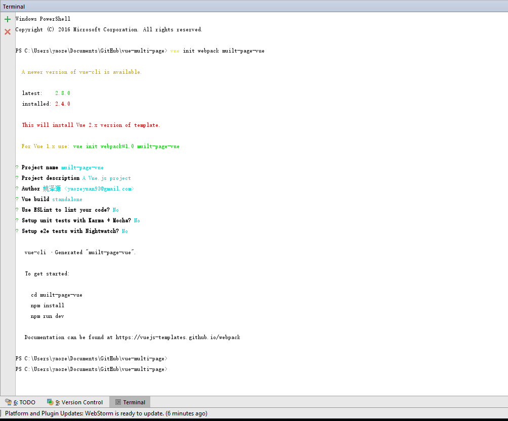
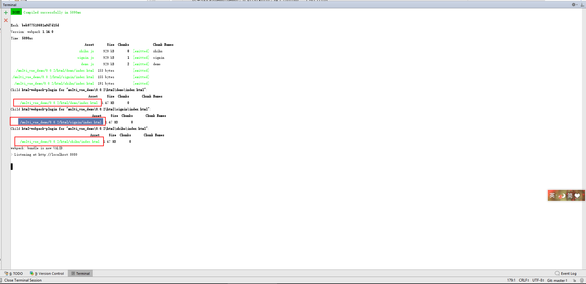

# vue-multi-page
vue多页面实践之路

##  实现思路：
1.  通过vue-cli，搭建出一套基础的vue框架
2.  通过修改框架代码，实现多页面结构的支持

##  具体实现

0.  默认系统环境及配置软件
    1.  Windows 10 + PowerShell
    2.  ConEmu

        可能是目前最好用的Windows终端，用户体验堪比Ubuntu自带的Terminal
    3.  VSCode

        有固态硬盘支持的情况下Windows平台中最好用的文本编辑器
    4.  WebStorm

        js开发必备ide，具体设置后边会详细介绍

1.  初始化Git目录
    1.  略过，参考提交记录
2.  安装配置基础工具
    1.  nodejs
    2.  npm
        1.  npm配置
            1.  由于GFW的原因, 用npm默认源是基本没法下载代码包的，所以需要切换成淘宝的源
                1.  执行命令  
                    ` npm config set registry="http://registry.npm.taobao.org" `

    3.  安装vue-cli
        1.  切换到待初始化vue项目的目录下, 执行命令 `npm install vue-cli`
            
    4.  创建基础的vue项目(vue2.0 + webpack)

        执行命令：`vue init webpack muilt-page-vue` ( 创建一个名为muilt-page-vue, 以webpack模版作为基底的vue项目, 更多选项参见[vue-cli的说明文档](https://github.com/vuejs/vue-cli))

        

        这里直接使用的默认选项，没有添加各种扩展的代码测试工具(普通开发基本用不着)
    5.  初始化vue项目
        1.  正如创建项目后提示的那样，cd到对应项目目录，然后执行`npm install`（安装各种依赖）
        2.  安装vue-router/vue-resource
            1.  正常项目肯定会用到这两个功能(vue-router => 路由， vue-resource => http请求)
            2.  执行`npm install vue-router vue-resource --save`
        3.  安装其他依赖(例如[element-ui](http://element.eleme.io/#/zh-CN)组件etc，这里随便安装就可以了)
    6.  执行到这一步之后，一个基础的vue单页面项目就已经建好了，如果直接运行`npm run dev`的话，就可以直接进行开发工作。但是因为我们要做的是多页面项目，所以下边就要开始各种魔改了
    7.  WebStorm配置

        在修改代码之前要先处理下WebStorm的配置问题，否则代码改起来会比较别扭
        1.  将js模式改为ES6模式，否则的话各种报错，没有import方法etc

            
        2.  关闭分号缺失提示

            vue-cli生成的模版里是不带分号的，所以需要在WebStorm里关掉分号缺失自动报错功能

            方法为：Setting中搜索unterminated ，去掉打钩

            

        3.  关闭safe-write功能

            这个选项会让WebStorm保存之后不直接写到原文件里，导致webpack dev模式监听不到文件变化，从而也就不会重新编代码，只有重新运行`npm run dev`才能加载新代码，非常麻烦
            所以一定要关掉它

            方法：Setting中搜索 `safe write`, 在System Setting里

            

        4.  添加debug功能

            我们在测试webpack功能的时候(例如写插件)需要单步执行命令，这时候就需要进行一下配置

            1.
                

            2.
                
        5.  【可选】打开node.js的库函数提示

            WebStorm支持对node.js自带的库函数进行提示,在设置中搜索`coding assistance`点击`enable`即可

            

    8.  创建基础目录结构
        1.  新加目录(以项目目录为当前目录)
            1.  ./dist

                用于对外发布编译后的文件
            2.  ./map

                输出map.json，控制文件版本(后边会有说明)
            3.  ./build/plugin/webpack

                用于存放webpack插件，输出map.json文件
            4.  ./src/fonts

                字体文件
            5.  ./src/img

                图片文件
            6.  ./src/media

                媒体文件
            7.  ./src/lib

                公用类库,当项目间有公用类库时, 可以存放在该目录下
            7.  ./src/utils

                通用工具方法,当项目间有通用的工具方法时,可以存放在该目录下
            7.  ./src/view

                项目目录，所有项目均存放在该目录下
        2.  删除无用的文件,添加.gitignore配置
            1.  删除`./src/assets/logo.png`, `./src/App.vue`, `./src/main.js`, 这三个文件是为配置单页面应用创建的，现在已经用不到了，直接删除掉即可
            2.  删除`./static`，这是默认的静态资源文件储存位置，我们把它迁移到了`./src/assert/`目录下，所以直接删掉即可
                1.  注意，这里需要将`./build/build.js`里的静态资源地址从`static/*`换成`'src/assets/'`
            3.  在.gitignore中添加`dist/`,`map/`配置，这两个文件夹都是用来存放对外输出结果的目录，所以需要忽略掉
        3.  目录说明

                |--build  基础配置文件
                |----plugin   项目插件,目前用于存放webpack的map.json生成插件
                |----build.js `npm run build` 的实际执行文件
                |----dev.client.js
                |----dev.server.js  `npm run dev`的实际执行文件
                |----utils.js 工具js, 存放通用的工具代码, 例如: 根据项目配置生成入口文件列表
                |----webpack.base.conf.js webpack基础配置
                |----webpack.dev.conf.js  webpack开发环境配置
                |----webpack.prod.conf.js webpack线上环境配置
                |--config 配置目录
                |----extend.conf.js 项目配置目录, 添加新项目时需要在该文件中进行登记
                |----index.js       对外暴露出的公共接口,项目主配置通过该文件对外传递
                |----dev.env.js     开发环境配置
                |----prod.env.js    线上环境配置
                |--dist 项目打包地址,打包后的代码会存放在该目录内
                |----growth_cp  项目名称
                |--------0.0.4  项目版本号，即.hgtags中最后一行的tag值 或 git的tag值
                |------------font 字体文件
                |------------img  图片文件
                |------------media  媒体文件
                |------------       font/img/media是由/build/build.js直接从/src/assets中复制过来，本身并没有经过其他处理. 需要注意
                |------------html html文件，仅用于查看结果
                |----------------signin 签到项目的html文件所在目录
                |------------js js文件
                |----------------signin_[chunk_hash]  siginin项目的js文件目录, 在目录名中添加hash值, 避免文件重复
                |--------------------signin.js  实际编译出来的siginin项目的js文件,使用项目原名，方便线上查找故障文件。
                |--------------------           目录命名规则在/build/webpack.prod.conf.js文件中，修改后需要在/build/plugin/webpack/create_map_json.js中进行相应的修改, 以确保正常生成map.json文件
                |--map  项目map.json存放地址, 项目的map.json生成后存放在该目录内
                |--src  项目目录，所有相关文件都在在里
                |----fonts 静态资源-字体
                |----img  静态资源-图片
                |----media  静态资源-其他媒体资源
                |----components 公用组件 当项目间有公用组件时, 可以存放在该目录下
                |----lib  公用类库 当项目间有公用类库时, 可以存放在该目录下
                |----utils  通用工具方法 当项目间有通用的工具方法时, 可以存放在该目录下
                |----view vue项目目录
                |------signin 签到项目目录
                |--------common 签到项目通用组件目录, 如果有组件只在签到项目中使用，则存放在该目录下
                |----------index.js 入口js文件, 【该名称为强制命名,使用其他名称会导致项目无法浏览】
                |----------index.html html根模版文件. vue项目只有一张启动页面，即该页面。【该名称为强制命名,使用其他名称会导致项目无法浏览】
                |----------router.js 路由js文件. 项目使用vue-router，使用该文件作为路由文件
                |----------main.vue 入口vue文件
                |----------lib 项目所依赖的库文件

    9.  修改默认配置代码

        这里我们以demo(demo),签到(signin),知乎(zhihu)三个项目为例
        1.  创建项目目录配置js
            1.  创建`./config/project.js`
                1.  在project配置中添加三个项目的【项目名】 => 【项目地址配置】
                2.  原理：
                    1.  该文件用于在项目中注册页面，后期添加新页面的时候只要在`./src/view`里创建一个文件夹，在`./config/project.js`里添加一条key=>value记录就可以了
                3.  配置项目名，tag获取方法(git/hg)
                2.  具体解释见文件注释,
            2.  修改`./config/index.js`内容，引入并对外发布`./config/project.js`
                1.  index.js的内容解释见文件注释
                2.  修改本地调试端口的话可以在index.js中修改dev.port的值(默认的8080已经够用了, 所以就没再加配置项)
        2.  添加插件
            1.  添加`./build/plugin/webpack/generate_html_template_list`插件，用于根据项目配置为webpack生成html配置模版
            2.  添加`./build/plugin/webpack/generate_map_json`插件，用于在编译好js后生成一份map.json，方便前端调用
        3.  修改webpack.base.conf.js配置
            1.  将entry由单入口修改为我们设置的`config.project_config.project`多入口即可
        4.  修改webpack.dev.conf.js配置
            1.  将生成html页面的plugin从之前的单入口HtmlWebpackPlugin()改为我们使用generate_html_template_list插件生成的一系列HtmlWebpackPlugin
            2.  详见文件内容
        5.  修改webpack.prod.conf.js配置
            1.  将生成html页面的plugin从之前的单入口HtmlWebpackPlugin()改为我们使用generate_html_template_list插件生成的一系列HtmlWebpackPlugin
            2.  添加map.json生成插件
            3.  其他修改详见文件内容
    10. 执行项目

        到这一步就可以编译具体项目了
        1.  本地测试
            1.  执行命令`npm run dev`
            2.  需要注意的是由于是多页面vue，所以执行该命令后需要手工输入index.html地址才能进入调试页面，如图所示

                

                红框部分即为demo、signin、zhihu对应的本地调试地址
                (

                http://localhost:8080/multi_vue_demo/0.0.2/html/demo/index.html、

                http://localhost:8080/multi_vue_demo/0.0.2/html/signin/index.html、

                http://localhost:8080/multi_vue_demo/0.0.2/html/zhihu/index.html

                )

        2.  线上编译
            `npm run build`